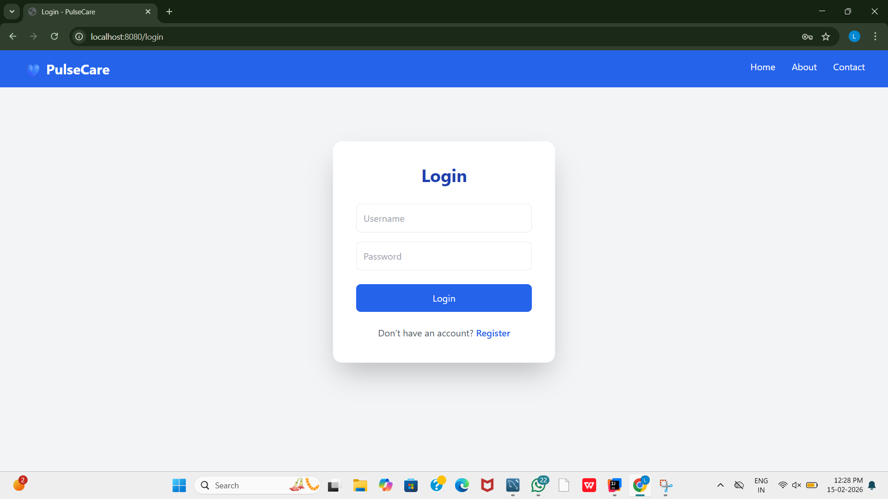
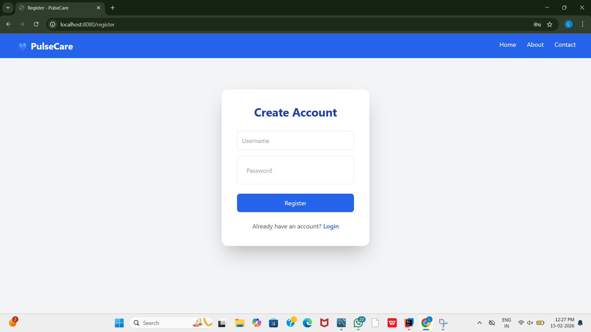
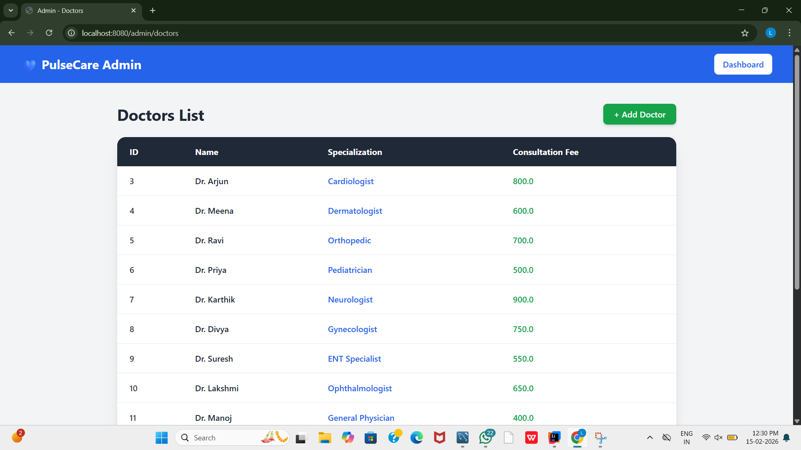
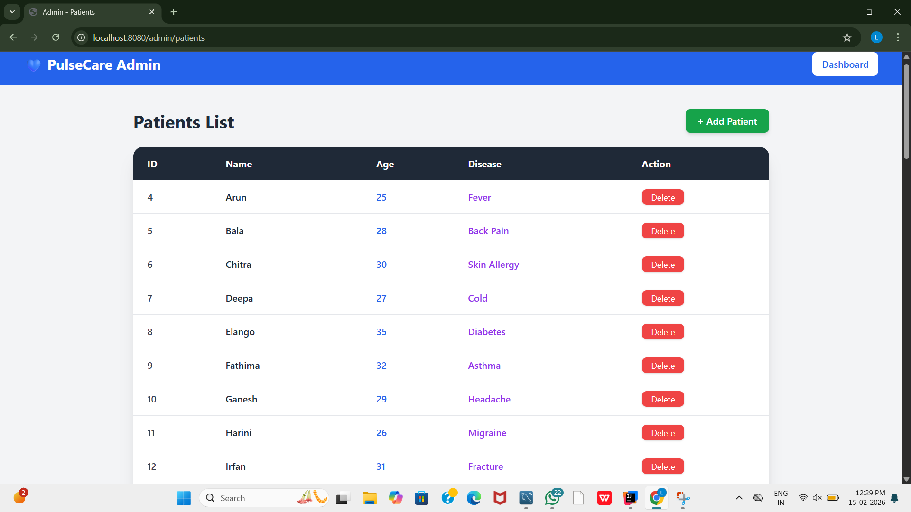
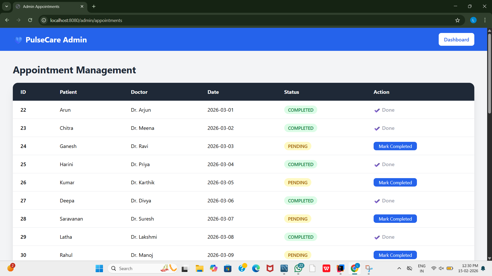

# 🏥 PulseCare - Hospital Management System

PulseCare is a full-stack Hospital Management System developed using Spring Boot and MySQL.  
This application allows users to register, login, manage patients, doctors, and book appointments efficiently.

---

## 🚀 Technologies Used

- Java 17
- Spring Boot
- Spring MVC
- Spring Data JPA (Hibernate)
- Thymeleaf
- MySQL
- HTML5
- CSS3
- Bootstrap
- Maven
- Git & GitHub

---

## 📂 Project Structure

pulsecare/

│
├── src/main/java/com/pulsecare

│ ├── controller

│ │ ├── LoginController.java

│ │ ├── PatientController.java

│ │ ├── DoctorController.java

│ │ └── AppointmentController.java

│ │
│ ├── service

│ │ ├── PatientService.java

│ │ ├── DoctorService.java

│ │ └── AppointmentService.java
│ │
│ ├── repository

│ │ ├── PatientRepository.java

│ │ ├── DoctorRepository.java

│ │ └── AppointmentRepository.java

│ │
│ └── model

│ ├── User.java

│ ├── Patient.java

│ ├── Doctor.java

│ └── Appointment.java

│
└── src/main/resources/templates

├── login.html

├── register.html

├── patients.html

├── doctors.html

├── appointments.html

---

## 🗄️ Database Tables

### 👤 User Table
- id (Primary Key)
- name
- email
- password
- role

### 🏥 Doctor Table
- id
- name
- specialization
- fee
- phone

### 🧑‍🤝‍🧑 Patient Table
- id
- name
- age
- gender
- disease
- phone

### 📅 Appointment Table
- id
- date
- doctor_name
- patient_name
- status
- booked_by

---

# 📸 Application Screenshots

---

## 🔐 Login Page

### What Happens Here?
- Existing users can login using email & password
- Validates user credentials
- Redirects to dashboard after successful login

---

## 📝 Register Page

### What Happens Here?
- New users can create account
- Stores user details in database
- Password securely saved

---

## 👨‍⚕️ Doctors Page

### What Happens Here?
- Displays all doctors
- Shows specialization, fee, phone
- Admin can add new doctors

---

## 🧑 Patients Page

### What Happens Here?
- Displays all registered patients
- Shows age, gender, disease
- Admin can add new patients

---

## 📅 Appointments Page

### What Happens Here?
- Book new appointment
- View all appointments
- Update appointment status (PENDING / COMPLETED)

---

# 🎥 Full Project Demo Video

[pulsecare.mp4](images/pulsecare.mp4)

---

# 🔄 Application Flow

1. User Registration
2. User Login
3. Add Doctors
4. Add Patients
5. Book Appointment
6. Manage Appointment Status

---

# 🎯 Use Cases

✔ Admin can manage doctors  
✔ Admin can manage patients  
✔ Users can book appointments  
✔ Track appointment status  
✔ Maintain hospital records digitally

---

# 💡 Key Features

- Secure Login & Registration
- MVC Architecture
- Database Integration
- Clean UI with Bootstrap
- CRUD Operations
- Appointment Management System

---

# ⚙️ How to Run the Project

1. Clone the repository
   https://github.com/Lekhasrik/pulsecare.git

2. Open in IntelliJ / VS Code

3. Configure MySQL in `application.properties`

4. Run Spring Boot Application

5. Open browser:
   http://localhost:8080

---

# 📌 Future Enhancements

- Role-based authentication (Admin/User)
- Email Notifications
- Payment Integration
- Dashboard Analytics
- REST API Version

---

# 👨‍💻 Developed By

Lekha sri K 
GitHub:https://github.com/Lekhasrik/pulsecare.git

